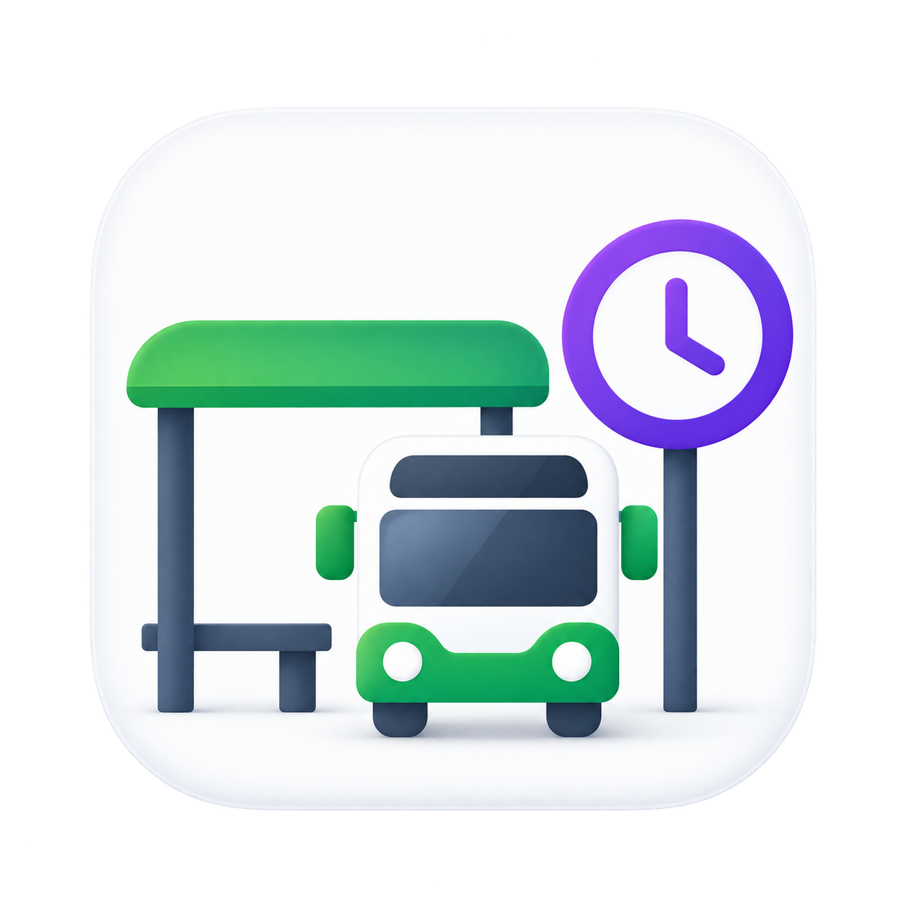
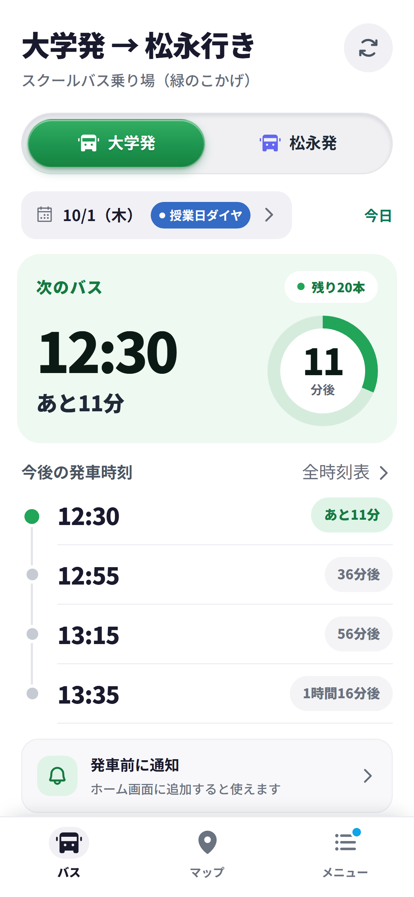
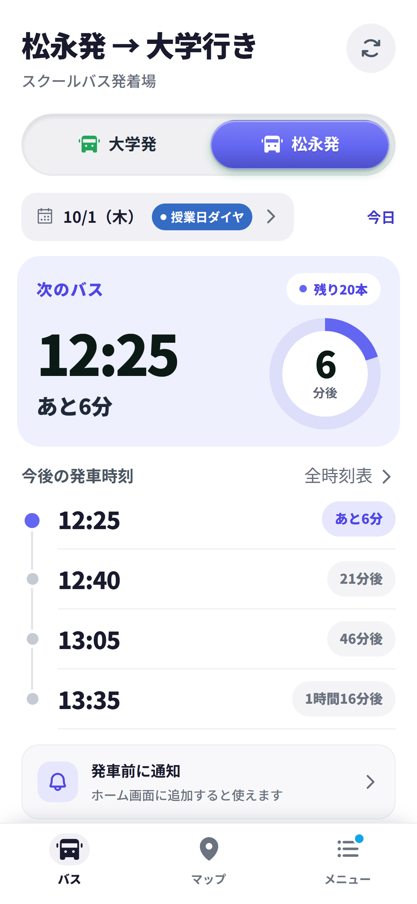

<h1 align="center">
  
  バスNAVI
</h1>

  福山大学スクールバスの次の発車時刻、当日の時刻表、乗り場を案内する Web アプリ（PWA）です。 
  campus-bus-navi

  <a href="https://campus-bus-navi.pages.dev/"><strong>アプリを開く</strong></a>
  &nbsp;·&nbsp;
  <a href="#できること">できること</a>
  &nbsp;·&nbsp;
  <a href="#使い方">使い方</a>
  &nbsp;·&nbsp;
  <a href="docs/README.md">開発・運用の文書</a>

  
  &nbsp;&nbsp;&nbsp;
  

  ホーム画面（左: 大学発、右: 松永発）。開発環境で撮影した画面で、表示日時は撮影用に固定しています。

---

学生・教職員が時刻表を探す手間や乗り場で迷う時間を減らすことを目指しています。

このアプリは **非公式の個人運営** です。福山大学を代表するもの、大学による承認・保証を示すものではありません。

> 現在はベータ版として運用しています。試験、移動、重要な予定に関わる場合は、必ず大学公式の時刻表・お知らせも確認してください。

## できること

| | 内容 |
| --- | --- |
| **次のバス** | 現在時刻（日本時間）に基づく次のバス、残り本数、直近の発車時刻を表示します。 |
| **ルート切替** | 松永発・大学発を切り替え、当日の全時刻表を確認できます。 |
| **週間ダイヤ** | 今日を含む 7 日間（6 日先まで）の運行予定を一覧し、日を選んでその日の全時刻表を確認できます。 |
| **ダイヤの自動切替** | 日付ごとのルールに基づき、授業日、休業日、長期休暇、イベント日などのダイヤへ切り替えます。 |
| **安全側の案内** | 全便運休日や、時刻を安全に確定できない特別ダイヤは、推測した時刻を出さずに案内します。 |
| **乗り場マップ** | Google マップの埋め込みで乗り場の地図と様子（ストリートビュー）を表示し、徒歩ルート案内を開けます。 |
| **発車前の通知** | 当日の便を選んで、発車前に通知を受け取れます（アプリを閉じていても届きます）。 |
| **オフライン表示** | 一度取得した時刻表・お知らせは通信できなくても表示します（地図とストリートビューは除く）。 |
| **設定** | お知らせ、テーマ、文字サイズ、初期表示路線を変えられます。 |

## 使い方

1. 画面下の「バス」「マップ」「メニュー」の 3 つのタブで切り替えます（PC では左のサイドバー）。「メニュー」タブから、お知らせ、週間ダイヤ、設定、ヘルプ、アプリの初期化を開けます。
2. 上部の切替で「大学発」と「松永発」を選べます。
3. ホーム上部の日付（例: 9/12（土））をタップするか、メニューの「週間ダイヤ」から、今日を含む 7 日間の運行予定を確認できます。日を選ぶとその日の発車時刻が出ます。
4. 右上の更新ボタンは、時刻データをサーバーから取り直します。
5. iPhone / iPad は Safari、Android は Chrome などのブラウザからホーム画面へ追加できます。

特別ダイヤの日は、誤った時刻を推測して表示しないため、発車時刻の代わりに大学公式サイトの確認先を案内します。全便運休日には、翌日の始発を案内します。

## 時刻表・通信について

時刻表、カレンダー、お知らせは静的なファイルとして配信しています。アプリ起動時に最新取得を優先し、通信できないときは端末に保存された前回取得分を表示します。そのため、通信状況や開いたままの画面では、更新直後の情報がただちに表示されない場合があります。

時刻表データは日付ごとのルールで選択されます。端末で祝日を自動判定しているわけではありません。

## 発車前の通知について

発車前の通知を使う場合にのみ、通知の配信に必要な情報をサーバーで預かります。

- **通知を使わない場合、サーバーとのやりとりは発生しません。** 時刻表の閲覧はこれまでどおり静的ファイルの取得だけで完結します。
- 通知をオンにすると、ブラウザが発行する**通知の宛先（プッシュ購読情報）**と、**設定した便の時刻・何分前に通知するか**を保存します。氏名、メールアドレス、学籍番号などの個人情報は一切扱わず、アカウント登録もありません。
- 通知を設定できるのは**当日ぶんだけ**です。翌日以降の便は予約できません。設定した通知は日付が変わると削除されます。
- 「発車リマインダー」をオフにすると、預かっている情報はすべて削除されます。削除できなかった場合は通知をオフにせず、エラーをお知らせします（画面だけオフになって情報が残る状態を作らないためです）。
- 通知そのものは、お使いのブラウザの提供元（Apple・Google など）のプッシュ配信網を経由して届きます。

iPhone・iPad では、**ホーム画面に追加したアプリから開いた場合のみ**通知を受け取れます（iOS の仕様）。Android・PC ではその制限はありません。

全便運休日、特別ダイヤの日、ダイヤの差し替えで設定した便がなくなった日には、存在しない便をお知らせしないため通知を送りません。

また、通知に載せる便が設定した内容と確かめられなかった場合は、便を決めつけずに「まもなく発車です。アプリを開いて時刻表を確認してください」とだけお知らせします。誤った時刻や方向をお伝えしないためです。

## 開発・運用に関わる方へ

実装、静的データの更新、PWA、Cloudflare Pages、検証、時刻表自動取り込み Bot の詳細は [docs/README.md](docs/README.md) にまとめています。利用者向けの README には、開発・運用の手順を重複して掲載しません。

## 権利・外部サービス

- アプリ本体のソースコード、自作文書、自作アセットに関する著作権は **campus-bus-navi** に帰属し、著作権表示は **© 2026 campus-bus-navi** です。
- campus-bus-navi は、このリポジトリを参考にすること、およびアプリ本体のソースコードを必要な範囲で複製・改変して独自のシステムを作成することを許可します。この許可は著作権を放棄するものではなく、リポジトリ全体をそのまま再配布する条件を定めるオープンソースライセンスでもありません。
- 福山大学の名称、公式サイト上の情報、時刻表などに関する権利・利用条件は、それぞれの権利者に帰属します。本アプリが大学公式の情報を代替・保証するものではありません。
- アプリは Google Fonts、Google マップ（乗り場の地図・ストリートビューの埋め込み表示と、徒歩ルート案内の起動）、Cloudflare Web Analytics を利用します。各サービスの利用条件・プライバシーに関する説明は提供元の文書を確認してください。
