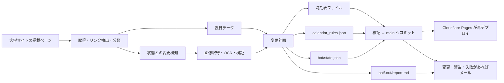

# 時刻表自動取り込み Bot

## 役割と正本

`bot/` は、大学サイトに掲載された時刻表画像を取得し、Gemini を使って JSON 化し、`public/data/` の更新内容を作る独立した Node.js パッケージです。利用者向け React アプリの実行経路には含まれません。

**2026-08-16 以降、取得から本番反映までは自動で行われます。** GitHub Actions が `main` へ直接コミットし、Cloudflare Pages が再デプロイします。人間の確認は事後で、**変更・要手動確認・失敗があった実行だけメールが届きます**。それ以前にあった「Bot が PR を作り、人間がレビューしてマージする」という人間ゲートは廃止されました。

Bot 本体は commit も push もしません。作業ツリーへファイルを書き、`bot/.out/report.md`（通知メールの本文になる実行レポート）を出すところまでが責務で、適用と送信はワークフローのステップです。

Bot の要件・安全境界の正本は [BACKEND_REQUIREMENTS.md](../bot/fixtures/_planning/BACKEND_REQUIREMENTS.md) です。日々の状態、次に行う人間作業、GitHub UI の手順は [HANDOFF.md](../bot/fixtures/_planning/HANDOFF.md) を参照します。この文書は、それらへ到達するための全体案内であり、詳細な要件を複製するものではありません。

## 実行フロー



オーケストレーションは `bot/src/index.ts`、純粋な変更計画は `bot/src/plan.ts`、書込制約は `bot/src/files.ts`、カレンダーの優先順位は `bot/src/calendar.ts`、通知本文は `bot/src/report.ts` にあります。図の右 2 段（適用と送信）は `.github/workflows/timetable-sync.yml` の担当です。

## 安全境界

Bot を変更する前に、以下を必ず維持してください。

| 領域 | 現在の制約 |
|---|---|
| 書込対象 | `timetable_weekday`、`timetable_holiday`、規約に合う vacation / event ファイル、カレンダー、state、祝日キャッシュだけ |
| 削除対象 | event 時刻表ファイルだけ |
| 保護対象 | `timetable_closed.json`、`timetable_special.json`、`_examples/` は書かない |
| 手動 override | Bot が管理していない override は最優先で、Bot は変更・削除しない |
| 管理 override の人手変更 | `suppressed_overrides` に記録し、以後 Bot は再生成しない |
| 未確定な掲示 | 時刻を作らない。期間が安全に読める場合だけ特別ダイヤにする |
| 非実在日・逆転期間 | 期間を残さず `needs_review` にする。特別ダイヤでは塗らない |
| 消えた未来イベント | 健全な抽出が 3 回連続で欠落した場合だけ撤去候補にする |
| 消えた通常ダイヤリンク | `warn` として必ずメールに載せる。既存ファイルは変更しない |
| 同一 URL の画像 | URL が同じでも中身の差し替えを確かめる（条件付き GET、または 7 日ごとの再取得）|
| 祝日 CSV | 実在日・重複なしを検査し、既存キャッシュ比で大きく減った応答は採用しない |
| 外部取得 | HTTPS、資格情報なし、IP リテラルなし、許可ホストだけ。リダイレクト各段も検査 |
| 取得の予算 | 取得フェーズに全体締切（8 分）とリンク数上限（24 件）を課す。超えた分は警告に落とす |
| データ整形 | 既存の JSON ハウススタイルを保ち、追えるコミット差分にする |
| 便数の急変 | 既存ファイルの更新で便数が ±50% を超えて変わったら、そのファイルを書かない |
| 適用前の検証 | コミット前に `node scripts/validate-data.mjs` を通す。落ちたら何もコミットしない |
| コミット対象 | `public/data`、`bot/state.json`、`bot/holidays.json` のみ。`git add -A` は使わない |
| 資格情報 | checkout は資格情報を残さず、push するステップの中だけで remote に token を差す |
| 通知 | 利用者に影響する削除を含む全変更と、書かなかった・消さなかった判断を必ずメールに載せる。過去日の override 剪定だけは更新通知から除く |

実行時間には 2 段の締切があります。**取得フェーズ**（画像の取得・再検証）はプロセス開始から 8 分で打ち切り、**OCR** は 15 分の全体締切で打ち切ります。どちらも GitHub Actions の 20 分タイムアウトより前に収束させるためで、強制終了されるとレポートも Step Summary も残らず、通知も飛ばない（失敗が最も観測しにくい形になる）ことを避けます。打ち切った分は黙って切らず、必ず警告としてメールに載せ、翌日の実行で再試行します。

Gemini 呼び出しには **1 実行あたり 18 回**と **1 日あたり 18 回**の 2 つの上限があります。日次の回数は `bot/state.json` の `ocr_usage` に持ち越すので、手動実行を繰り返しても無料枠の RPD を超えません。

### 同じ URL のまま画像が差し替わったとき

以前は「state の URL と今回の URL が同じ」だけで変更なしと判断していました。大学の CMS が同じ URL の内容を差し替えると、URL か state が別途変わるまで古い時刻表を出し続けます（見逃し期間に上限がありませんでした）。

現在は次のように確かめます。

- `ETag` / `Last-Modified` が state にあれば、毎回の条件付き GET（`If-None-Match` / `If-Modified-Since`）で確認する。変わっていなければ 304 が返るだけで、画像本体の転送は起きません
- 検証子を返さない配信元向けの保険として、最後に内容を確認できた日から 7 日以上経っていれば画像を取り直し、SHA-256 を比べます
- 確かめられなかった回は「変化なし」と断定せず、その旨を記録します。長く確認できていない状態（21 日）が続いたら警告へ格上げします

これで見逃し期間の上限が、無限から「検証子があれば 1 日、無くても最長 7 日」になります。検証子と確認日は `bot/state.json` の各エントリ（`etag` / `last_modified` / `checked_at`）に持ちます。いずれも任意項目なので、これらを持たない古い state もそのまま読めます。

人間の事前レビューが無くなったぶん、誤読は「公開されてから気づく」ことになります。これは 2026-08-16 に受容された残存リスクで、緩和は 2 回読み照合・特別ダイヤのフェイルセーフ・便数ガード・適用前検証・**通知メールに発車時刻そのものを載せること**の 5 層です。詳細は要件定義 §15-1 を参照してください。

## ローカルでの安全な確認

最初は書込も OCR も行わない経路を使います。

```powershell
Set-Location bot
npm ci
npx vitest run
npx tsc --noEmit
$env:DRY_RUN = "1"
$env:SKIP_OCR = "1"
npx tsx src/index.ts
```

- `DRY_RUN=1` は変更計画を出しますが、ファイル、state、実行レポートは書きません。ワークフロー側もコミットと通知をすべてスキップします。
- `SKIP_OCR=1` は Gemini 呼び出しを避けます。
- **ローカル実行は commit も push もしません。** 実行後は `git status` と `git diff` で内容を確認してください。
- 通常実行で OCR 対象があり鍵がなければ、書込前に明確に失敗する設計です。
- `bot/.env.local` の `GEMINI_API_KEY` はローカル専用です。内容を読んだり、出力したり、コミットしたりしてはいけません。

## GitHub Actions

実行可能な定義は [.github/workflows/timetable-sync.yml](../.github/workflows/timetable-sync.yml) です。日次の cron は 07:00 JST を意図し、同時実行を直列化し、Node.js 22 と `npm ci` を使います。

Action は full commit SHA 固定で、checkout は資格情報を後続ステップに残しません。失敗時も `bot/.out/**` を成果物として残し、コミットは許可したパスだけを対象にします。

**`main` 以外の ref では実行できません。** 手動実行では ref を自由に選べますが、このワークフローは `HEAD:main` を push するため、別の ref で走らせると Bot が作った差分だけでなく、その ref に既にあるコミットまで `main` へ運んでしまいます。先頭のガードステップで止め、push ステップにも同じ条件を持たせています。ブランチで試すときは `dry_run` を有効にしてください（何も書かず、コミットも通知もしません）。

push が拒否されて rebase したときは、**組み合わせ後のツリーで検証をやり直してから** push します。個別には検証済みでも、Bot の差分と `main` の新しい変更を合わせた結果は未検証だからです。データ検証か変更範囲の検査に落ちたら push せずジョブを失敗させます（当日ぶんは翌日に再試行されます）。

`permissions: contents: write` は job 全体に効きます（GitHub の permissions は job 単位でしか付けられない）。push 専用の job へ分離すれば境界を狭められますが、Bot が書いた作業ツリーを artifact 経由で受け渡す必要があり、複雑さに見合わないと判断して**残存リスクとして受容**しています。緩和は、外部 action の full SHA 固定、fork / PR からは起動しないこと、checkout が資格情報を残さないこと、runner が実行ごとに破棄されることです。

通知が届く条件は次のとおりです。時刻表ファイルなど利用者に影響する `public/data/` の差分があったとき、要手動確認があったとき、ジョブが失敗したとき、そして**毎月 1 日**です。前日までの管理 override を `calendar_rules.json` から剪定しただけなら、今日以降にアプリが選ぶ時刻表は変わらないため更新メールを送りません。判定を誤って重要な変更を隠さないよう、Bot の計画が「過去日の削除だけ」であり、かつ実際の `public/data` 差分が `calendar_rules.json` だけである場合に限って抑止します。時刻表ファイルや他の public データが1件でも変われば通知します。

月初の通知は「日次実行が生きている」ことを確かめるための稼働確認（heartbeat）で、変更が無くても送ります。変更も警告も無い日は届きません（月初を除く）。ドライラン実行と、人が手でキャンセルした実行でも送りません。なお、期限切れ override の剪定や `checked_at` などの運用メタデータは引き続き commit され得ます。メールの有無と commit の有無は同じではありません。

必要な Secrets は `GEMINI_API_KEY` と、メール用の `MAIL_USERNAME` / `MAIL_PASSWORD` / `MAIL_TO` です。メール用の 3 件は `bot/` のコードからは参照されず、送信ステップだけが使います。

ワークフローの有効・無効、Secrets、Workflow permissions、`main` の実 SHA、実際のコミット・メール到達・本番反映は GitHub の外部状態です。リポジトリのコメントや過去の引継ぎ記録を現在の状態として扱わず、確認が必要なときは GitHub UI で確認してください。**2026-09-01 時点で、ワークフローは有効化済みで、毎日 `main` へ自動反映されています**（2026-08-16 時点では自動適用と通知は 1 度も実行されていませんでしたが、その後の人間側の設定作業を経て稼働を開始しました）。メール到達と Cloudflare Pages への実反映は運用者が確認済みです。**2026-09-02 に AC-4 の日次メール問題をローカルで修正しましたが、GitHub Actions 上の通知抑止は `main` 反映後の無変更日まで未確認です**（詳細は `bot/fixtures/_planning/HANDOFF.md`）。

## 誤った内容が反映されたとき

自動適用では「気づいたときにはもう公開されている」ため、戻し方が唯一の復旧導線になります。**再公開を止める手順と、読み直させる手順は別物です。混ぜてはいけません。**

1. GitHub の該当コミットを **Revert** する。`public/data/` と `bot/state.json` が一緒に戻ります。
2. **そのままだと翌日の実行で同じ画像を読み直し、同じ内容が再び反映されます。** revert で state も戻り、Bot から見て「未処理」に戻るためです。再公開を止めるには次のどちらかを行います。
   - `public/data/calendar_rules.json` の `overrides` に手動で `timetable_special` を指定する（手動 override を Bot は書き換えません）。時刻を出さず大学ホームページへ誘導します。
   - 急ぐ場合は Actions 画面で `timetable-sync` を Disable する。
3. `bot/state.json` の該当キーを削除するのは、**わざと読み直させたいとき**だけです。停止手段ではありません。

同じ手順が通知メールの末尾にも入ります（`bot/src/report.ts` の `rollbackSection()`）。片方だけ変えると、運用者を誤った方向へ誘導します。

## 変更時の読み順

1. `BACKEND_REQUIREMENTS.md` の該当 FR、NFR、AC を読む。
2. `bot/src/` とテストを読む。特に `files.ts`、`calendar.ts`、`plan.ts`、`url.ts`、`fetchPage.ts` は安全境界に関わる。通知内容を変えるなら `report.ts`。
3. 適用と通知を変えるなら `.github/workflows/timetable-sync.yml` を読む。
4. `HANDOFF.md` で外部作業の残りを確認する。
5. ドライラン、テスト、型検査、`node scripts/validate-data.mjs` を行う。
6. 実装・ワークフロー・手順を変えたなら、要件正本、引継ぎ、ここ、[verification.md](verification.md) を同じ変更で更新する。

