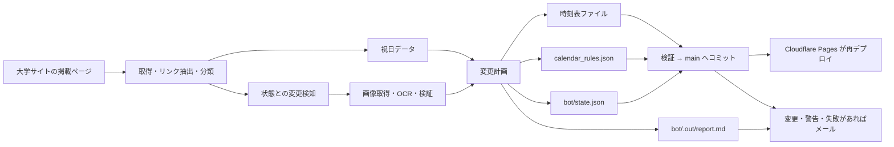

# 時刻表自動取り込み Bot

## 役割と正本

`bot/` は、大学サイトに掲載された時刻表画像を取得し、Gemini を使って JSON 化し、`public/data/` の更新内容を作る独立した Node.js パッケージです。利用者向け React アプリの実行経路には含まれません。

**2026-08-16 以降、取得から本番反映までは自動で行われます。** GitHub Actions が `main` へ直接コミットし、Cloudflare Pages が再デプロイします。人間の確認は事後で、**変更・要手動確認・失敗があった実行だけメールが届きます**。それ以前にあった「Bot が PR を作り、人間がレビューしてマージする」という人間ゲートは廃止されました。

Bot 本体は commit も push もしません。作業ツリーへファイルを書き、`bot/.out/report.md`（通知メールの本文になる実行レポート）を出すところまでが責務で、適用と送信はワークフローのステップです。

Bot の要件・安全境界の正本は [BACKEND_REQUIREMENTS.md](../bot/fixtures/_planning/BACKEND_REQUIREMENTS.md) です。日々の状態、次に行う人間作業、GitHub UI の手順は [HANDOFF.md](../bot/fixtures/_planning/HANDOFF.md) を参照します。この文書は、それらへ到達するための全体案内であり、詳細な要件を複製するものではありません。

## 実行フロー



オーケストレーションは `bot/src/index.ts`、純粋な変更計画は `bot/src/plan.ts`、書込制約は `bot/src/files.ts`、カレンダーの優先順位は `bot/src/calendar.ts`、通知本文は `bot/src/report.ts` にあります。図の右 2 段（適用と送信）は `.github/workflows/timetable-sync.yml` の担当です。

## 安全境界

Bot を変更する前に、以下を必ず維持してください。

| 領域 | 現在の制約 |
|---|---|
| 書込対象 | `timetable_weekday`、`timetable_holiday`、規約に合う vacation / event ファイル、カレンダー、state、祝日キャッシュだけ |
| 削除対象 | event 時刻表ファイルだけ |
| 保護対象 | `timetable_closed.json`、`timetable_special.json`、`_examples/` は書かない |
| 手動 override | Bot が管理していない override は最優先で、Bot は変更・削除しない |
| 管理 override の人手変更 | `suppressed_overrides` に記録し、以後 Bot は再生成しない |
| 未確定な掲示 | 時刻を作らない。期間が安全に読める場合だけ特別ダイヤにする |
| 非実在日・逆転期間 | 期間を残さず `needs_review` にする。特別ダイヤでは塗らない |
| 消えた未来イベント | 健全な抽出が 3 回連続で欠落した場合だけ撤去候補にする |
| 外部取得 | HTTPS、資格情報なし、IP リテラルなし、許可ホストだけ。リダイレクト各段も検査 |
| データ整形 | 既存の JSON ハウススタイルを保ち、追えるコミット差分にする |
| 便数の急変 | 既存ファイルの更新で便数が ±50% を超えて変わったら、そのファイルを書かない |
| 適用前の検証 | コミット前に `node scripts/validate-data.mjs` を通す。落ちたら何もコミットしない |
| コミット対象 | `public/data`、`bot/state.json`、`bot/holidays.json` のみ。`git add -A` は使わない |
| 資格情報 | checkout は資格情報を残さず、push するステップの中だけで remote に token を差す |
| 通知 | 削除を含む全変更と、書かなかった・消さなかった判断を必ずメールに載せる。黙って反映も、黙って停止もしない |

Bot が利用できる時間は内部で 15 分に制限し、GitHub Actions の 20 分タイムアウトより前に `needs_review` へ収束させます。Gemini 呼び出しにも 1 実行あたりの上限があります。

人間の事前レビューが無くなったぶん、誤読は「公開されてから気づく」ことになります。これは 2026-08-16 に受容された残存リスクで、緩和は 2 回読み照合・特別ダイヤのフェイルセーフ・便数ガード・適用前検証・**通知メールに発車時刻そのものを載せること**の 5 層です。詳細は要件定義 §15-1 を参照してください。

## ローカルでの安全な確認

最初は書込も OCR も行わない経路を使います。

```powershell
Set-Location bot
npm ci
npx vitest run
npx tsc --noEmit
$env:DRY_RUN = "1"
$env:SKIP_OCR = "1"
npx tsx src/index.ts
```

- `DRY_RUN=1` は変更計画を出しますが、ファイル、state、実行レポートは書きません。ワークフロー側もコミットと通知をすべてスキップします。
- `SKIP_OCR=1` は Gemini 呼び出しを避けます。
- **ローカル実行は commit も push もしません。** 実行後は `git status` と `git diff` で内容を確認してください。
- 通常実行で OCR 対象があり鍵がなければ、書込前に明確に失敗する設計です。
- `bot/.env.local` の `GEMINI_API_KEY` はローカル専用です。内容を読んだり、出力したり、コミットしたりしてはいけません。

## GitHub Actions

実行可能な定義は [.github/workflows/timetable-sync.yml](../.github/workflows/timetable-sync.yml) です。日次の cron は 07:00 JST を意図し、同時実行を直列化し、Node.js 22 と `npm ci` を使います。

Action は full commit SHA 固定で、checkout は資格情報を後続ステップに残しません。失敗時も `bot/.out/**` を成果物として残し、コミットは許可したパスだけを対象にします。

通知が届く条件は次のとおりです。`public/data/` に差分があったとき、要手動確認があったとき、ジョブが失敗したときで、いずれの場合も件名で区別できます。**変更も警告も無い日は届きません。** ドライラン実行と、人が手でキャンセルした実行でも送りません。

必要な Secrets は `GEMINI_API_KEY` と、メール用の `MAIL_USERNAME` / `MAIL_PASSWORD` / `MAIL_TO` です。メール用の 3 件は `bot/` のコードからは参照されず、送信ステップだけが使います。

ワークフローの有効・無効、Secrets、Workflow permissions、実際のコミット・メール到達・本番反映は GitHub の外部状態です。リポジトリのコメントや過去の引継ぎ記録を現在の状態として扱わず、稼働前に GitHub UI で確認してください。**2026-08-16 時点で、自動適用と通知は GitHub 上で 1 度も実行されていません。**

## 変更時の読み順

1. `BACKEND_REQUIREMENTS.md` の該当 FR、NFR、AC を読む。
2. `bot/src/` とテストを読む。特に `files.ts`、`calendar.ts`、`plan.ts`、`url.ts`、`fetchPage.ts` は安全境界に関わる。通知内容を変えるなら `report.ts`。
3. 適用と通知を変えるなら `.github/workflows/timetable-sync.yml` を読む。
4. `HANDOFF.md` で外部作業の残りを確認する。
5. ドライラン、テスト、型検査、`node scripts/validate-data.mjs` を行う。
6. 実装・ワークフロー・手順を変えたなら、要件正本、引継ぎ、ここ、[verification.md](verification.md) を同じ変更で更新する。

